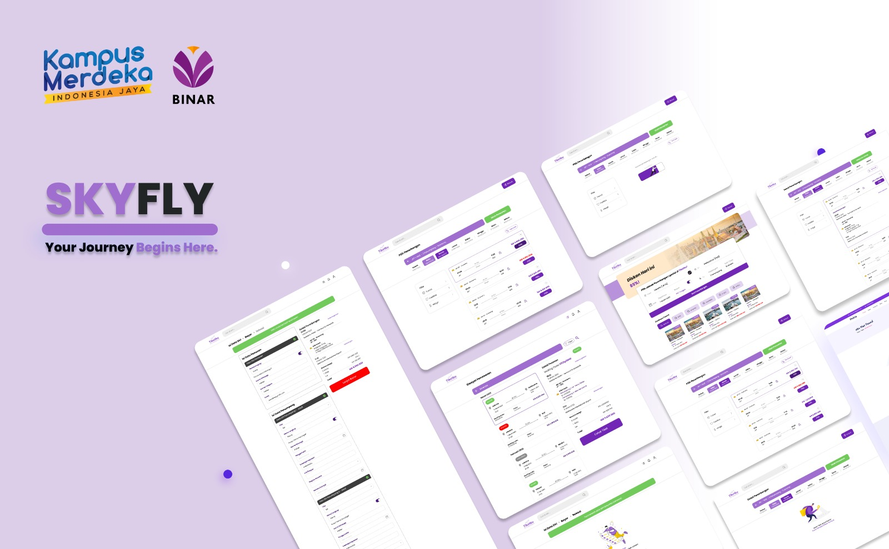

# Binar Final Project - Skyfly Admin Dashboard

     

 

### Team C-1 Skyfly!

Skyfly API allows you to get the needed resources to make Skyfly application run seamlessly. Some of this service is using authentication to access each service. You need to login first to access the service.

### Overview

SkyFly is an online flight ticket booking application designed to provide a seamless and user-friendly experience for booking flights. This project uses ExpressJs as the backend framework and Postgres as the database, managed through Prisma ORM. The application supports various functionalities essential for an efficient flight booking system.

# Data Team C1

|                   |                                                                                                                                             | **LinkedIn**                                                                 | **Github**                                    |
| ----------------- | ------------------------------------------------------------------------------------------------------------------------------------------- | ---------------------------------------------------------------------------- | --------------------------------------------- |
| **FSW**           | _Reinanda Faris_                                                                                                                            | [LinkedIn](https://www.linkedin.com/in/reinanda-faris/)                      | [Github](https://github.com/Reinandafaris)    |
|                   | _Viery Nugroho_                                                                                                                             | [LinkedIn](https://www.linkedin.com/in/viery-nugroho)                        | [Github](https://github.com/vierynugroho)     |
|                   | _Andhika Rizky Aulia_                                                                                                                       | [LinkedIn](https://www.linkedin.com/in/andhika-rizky/)                       | [Github](https://github.com/ndikrp)           |
|                   | _Ananda Ias Falah_                                                                                                                          | [LinkedIn](https://www.linkedin.com/in/falahsuryagemilang/)                  | [Github](https://github.com/falahsg)          |
|                   | _Naufal Ady Saputro_                                                                                                                        | [LinkedIn](https://www.linkedin.com/in/naufal-ady-saputro-71050b24b/)        | [Github](https://github.com/naufaladysaputro) |
|                   | _Rizki Mauludin Yoga P._                                                                                                                    | [LinkedIn](https://www.linkedin.com/in/riski-mauludin-yoga-8718602b0/)       | [Github](https://github.com/RMYP)             |
|                   | _Rafi Husein Bagaskara_                                                                                                                     | [LinkedIn](https://www.linkedin.com/in/rafi-husein-257a76291)                | [Github](https://github.com/raisenbk)         |
|                   | _Lowis Armando Hutabarat_                                                                                                                   | [LinkedIn](www.linkedin.com/in/lowis-armando-hutabarat-80b7612b3)            | [Github](https://github.com/LowisHutabarat)   |
|                   |                                                                                                                                             |
| **AND**           | _Komang Yuda Saputra_                                                                                                                       | [LinkedIn](https://www.linkedin.com/in/komang-yuda-saputra-abb21b291/)       | [Github](https://github.com/YudaSaputraa)     |
|                   | _Ihsan Widagdo_                                                                                                                             | [LinkedIn](https://www.linkedin.com/in/ihsan-widagdo/)                       | [Github](https://github.com/dagdo03)          |
|                   | _Bella Febriany Nawangsari_                                                                                                                 | [LinkedIn](https://www.linkedin.com/in/bella-febriany-nawangsari-4642a3291/) | [Github](https://github.com/bellafebrianyn)   |
|                   | _Mochammad Yusuf Pratama_                                                                                                                   |                                                                              |                                               |
|                   |                                                                                                                                             |
| **Project Title** | _SKY-FLY_                                                                                                                                   |
|                   |                                                                                                                                             |
| **Note**          | _Binar KM6_                                                                                                                                 |
|                   | [Trello Team C1 Binar KM6](https://trello.com/c/2XzOhXim/60-c1-binar-km6-fsw-x-and)                                                         |
|                   | [Daily Stand-Up Team C1 Binar KM6](https://docs.google.com/spreadsheets/d/1aCpje7mQnG5uhmBOh9sEThQKYgatLdNpPoSoQK6VUvk/edit#gid=1785037003) |
|                   | [Deployed API](https://backend-skyfly-c1.vercel.app/api-docs/)                                                                              |

---
